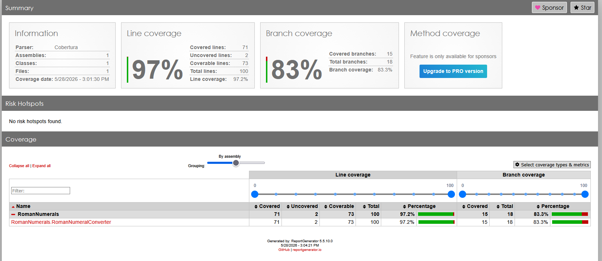

# SW Challenge 2: TDD with a Simple Domain

This challenge is about practicing Test-Driven Development using a small Roman numeral converter library.

## Project setup

There are 2 separate projects, one for the library and the second the test

## Commands to run the test

```bash
cd .\RomanNumerals.Tests\
dotnet test
```
It exist two different clases:
- RomanNumeralConverterTest
- RomanToIntegerConvertionTest
If you want to run it separately use this command
```bash
cd .\RomanNumerals.Tests\
dotnet test RomanNumerals.Tests.csproj --filter "FullyQualifiedName~RomanNumeralConverterTest"
dotnet test RomanNumerals.Tests.csproj --filter "FullyQualifiedName~RomanToIntegerConvertionTest"
```

## Run test coverage
In order to visualize the xml report that is generated by the *coverlet* library we need to install a *ReportGenerator* library

```bash
cd .\RomanNumerals.Tests\
dotnet tool install --global dotnet-reportgenerator-globaltool
```

Run the command to export the test coverage results in xml
```bash
dotnet test --collect:"XPlat Code Coverage"
```

Then generate the report in hmtl
```bash
reportgenerator -reports:"TestResults\**\coverage.cobertura.xml" -targetdir:"coverage-report" -reporttypes:Html
```
Screenshot report

