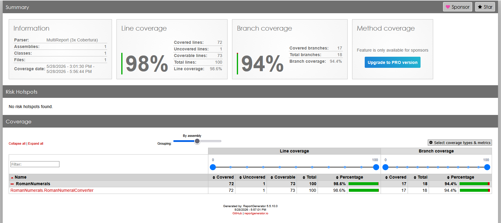

# SW Challenge 2: TDD with a Simple Domain

This challenge is about practicing Test-Driven Development using a small Roman numeral converter library.

## Project setup

There are 2 separate projects, one for the library and the second the test

## Commands to run the test

```bash
cd .\RomanNumerals.Tests\
dotnet test
```
It exist two different clases:
- RomanNumeralConverterTest
- RomanToIntegerConvertionTest
If you want to run it separately use this command
```bash
cd .\RomanNumerals.Tests\
dotnet test RomanNumerals.Tests.csproj --filter "FullyQualifiedName~RomanNumeralConverterTest"
dotnet test RomanNumerals.Tests.csproj --filter "FullyQualifiedName~RomanToIntegerConvertionTest"
```

## Run test coverage
In order to visualize the xml report that is generated by the **coverlet** library we need to install a **ReportGenerator** library

```bash
cd .\RomanNumerals.Tests\
dotnet tool install --global dotnet-reportgenerator-globaltool
```

Run the command to export the test coverage results in xml
```bash
dotnet test --collect:"XPlat Code Coverage"
```

Then generate the report in hmtl
```bash
reportgenerator -reports:"TestResults\**\coverage.cobertura.xml" -targetdir:"coverage-report" -reporttypes:Html
```
Screenshot report


## Logic to accomplish the solution Interger to Roman
We started with the convertion from integer to roman number

At the begging, from 1 to 10, we just added a switch stamente to return the correct value
And we increase the numbers litle by litle, we understan that there are 2 types of conbinamtios i calles twin for any number that starts with 4 and 9, and a single that are any number divisible by 5.

So the idea to converter and integer into roman number is by comparing if the given number is greater or equal than the number defined in this list:
```array
("M", 1000),
("CM", 900),
("D", 500),
("CD", 400),
("C", 100),
("XC", 90),
("L", 50),
("XL", 40),
("X", 10),
("IX", 9),
("V", 5),
("IV", 4),
("I", 1)
```
then make a recursive call to the same methods but before doing that substracting the amount of number that is set it in the list.
For example
34
We loop with the array above, and since 34 is greater than 10, we add and "X" then call the same method but substracting 10.
Then we have 20, we also add a new "X" then call again the same method but substracting 10.
Now we have 10, since it is equal, we also add a "X" then call again the same method but substracting 10.
Now we have 3, which is greater that 1, so do a similar thing from before until we get 0, which will return and empty string and will end up the recursive function.

Previously we were doing this with lots of if conditions, but later we refactored the code to use tuples array and a for loop.

To extend the range or limit of conversion we should add into the tuple array the roman character.

## Logic to accomplish the solution Roman to Interger
We started with a similar approach here, first adding failing test, then trying to solve the main issue in the method.

We just started from 1 to 10 and added a switch statement to return the correct conversion.

After that we increase the range and add more if conditions, but we had like half of the test failing.

While we were trying to solve those erros, we made this excersise in text, to understan how we should actually convert the values.

I we just convert the caracter one by one
```text
44 XLIV

10 + 50 + 1 + 5
a    b
a < b ? b - a : a + b;

43 XLIII
10 + 50 + 1 + 1 + 1

34 XXXIV
10 + 10 + 10 + 1 + 5
a < b ? b - a : a + b;

399 CCCXCIX
100 + 100 + 100 + 10 + 100 + 1 + 10
```

There are some times that we need to to substract, when the next value is greater that the previous, but that does not happern always, because we were putting this into a loop and increasing the index by 2 and we had error with values like "III", "VII". Then we added a condition to verify that the string has even number, and when it is odd add a different logic. This caused more issues.

```dictionary single
{ "I", 1 },
{ "V", 5 },
{ "X", 10 },
{ "L", 50 },
{ "C", 100 },
{ "D", 500 },
{ "M", 1000 }
```

```twin
{ "IV", 4 },
{ "IX", 9 },
{ "XL", 40 },
{ "XC", 90 },    
{ "CD", 400 },
{ "CM", 900 },
```

After some time we realize that we have to:
1. Start an index at 0.

2. Create to dictionaries with twin numbers and single number and check first if there are twin available letters.

3. If that is the case, take the value from twin character dictionary, and add that value to the total then increase the index by two.

4. if not, take the letter from single character dictionary, add that value to the total and increase the index by one

Based on that analisis we completed successfully the conversion.

## Extension to higher range 
```characters
L̅ = 50000
C̅ = 100000
D̅ = 500000
M̅ = 1000000
```
